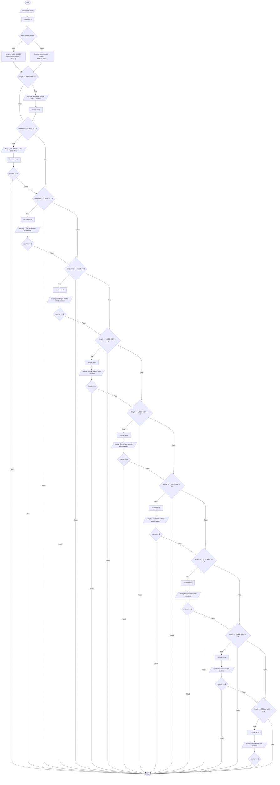

```mermaid
flowchart TB
START(["Start"])
START --> B[/"read length,width"/]
B --> C["counter = 0"]

DIMENSION1{"width > temp_length"}

DIMENSION1TRUE["length = width - (1.6*2) <br>width = temp_length - (1.6*2)</br>"]

DIMENSION1FALSE["length = temp_length - (1.6*2) <br>width -= (1.6*2)</br>"]

C --> DIMENSION1
DIMENSION1 --> |"true"|DIMENSION1TRUE
DIMENSION1 -->|"false"| DIMENSION1FALSE

DIMENSION1TRUE & DIMENSION1FALSE --> IF1 --> |"True"|DISPLAY1 --> COUNTER1

IF1{"length >= 3 && width >= 1"}
DISPLAY1[/"Display 'Rectangle Shade with 12 seaters'"/]
COUNTER1["counter += 1"]

IF1 -->|"False"|IF2
COUNTER1 -->IF2 -->|"True"| DISPLAY2 --> COUNTER2

IF2{"length >= 3 && width >= 1.3"}
DISPLAY2[/"Display 'Oval Stefan with 10 seaters'"/]
COUNTER2["counter += 1"]
COUNTER2 --> EXIT2{"counter == 2"} -->|"TRUE"| END(["End"])
EXIT2 --> |"False"|IF3

IF3{"length >= 3 && width >= 1.3"}
DISPLAY3[/"Display 'Oval Stefan with 10 seaters'"/]
COUNTER3["counter += 1"]
COUNTER3 --> DISPLAY3 --> EXIT3{"counter == 2"} -->|"TRUE"| END(["End"])
EXIT3 -->|"False"| IF4

IF2 --> |"False"|IF3
IF3 --> |"True"|COUNTER3
IF3 --> |"False"|END

IF4{"length >= 2.1 && width >= 1"}
DISPLAY4[/"Display 'Rectangle Bertha with 8 seaters'"/]
COUNTER4["counter += 1"]
COUNTER4 --> DISPLAY4 --> EXIT4{"counter == 2"} -->|"TRUE"| END(["End"])
EXIT4 -->|"False"| IF5

IF3 --> |"False"|IF4
IF4 --> |"True"|COUNTER4
IF4 --> |"False"|END

IF5{"length >= 1.5 && width >= 1.5"}
DISPLAY5[/"Display 'Round Nadine with 8 seaters'"/]
COUNTER5["counter += 1"]
COUNTER5 --> DISPLAY5 --> EXIT5{"counter == 2"} -->|"TRUE"| END(["End"])
EXIT5 -->|"False"| IF6

IF4 --> |"False"|IF5
IF5 --> |"True"|COUNTER5
IF5 --> |"False"|END

IF6{"length >= 1.3 && width >= 0.8"}
DISPLAY6[/"Display 'Rectangle Heinrich with 6 seaters'"/]
COUNTER6["counter += 1"]
COUNTER6 --> DISPLAY6 --> EXIT6{"counter == 2"} -->|"TRUE"| END(["End"])
EXIT6 -->|"False"| IF7

IF5 --> |"False"|IF6
IF6 --> |"True"|COUNTER6
IF6 --> |"False"|END

IF7{"length >= 1.5 && width >= 0.9"}
DISPLAY7[/"Display 'Rectangle Niklas with 6 seaters'"/]
COUNTER7["counter += 1"]
COUNTER7 --> DISPLAY7 --> EXIT7{"counter == 2"} -->|"TRUE"| END(["End"])
EXIT7 -->|"False"| IF8

IF6 --> |"False"|IF7
IF7 --> |"True"|COUNTER7
IF7 --> |"False"|END

IF8{"length >= 1.35 && width >= 1.35"}
DISPLAY8[/"Display 'Round Emma with 6 seaters'"/]
COUNTER8["counter += 1"]
COUNTER8 --> DISPLAY8 --> EXIT8{"counter == 2"} -->|"TRUE"| END(["End"])
EXIT8 -->|"False"| IF9

IF7 --> |"False"|IF8
IF8 --> |"True"|COUNTER8
IF8 --> |"False"|END

IF9{"length >= 0.9 && width >= 0.9"}
DISPLAY9[/"Display 'Square Lea with 4 seaters'"/]
COUNTER9["counter += 1"]
COUNTER9 --> DISPLAY9 --> EXIT9{"counter == 2"} -->|"TRUE"| END(["End"])
EXIT9 -->|"False"| IF10

IF8 --> |"False"|IF9
IF9 --> |"True"|COUNTER9
IF9 --> |"False"|END

IF10{"length >= 0.76 && width >= 0.76"}
DISPLAY10[/"Display 'Square Finn with 2 seaters'"/]
COUNTER10["counter += 1"]
COUNTER10 --> DISPLAY10 --> EXIT10{"counter == 2"} -->|"TRUE"| END(["End"])
EXIT10 -->|"False"| END

IF9 --> |"False"|IF10
IF10 --> |"True"|COUNTER10
IF10 --> |"False"|END
```