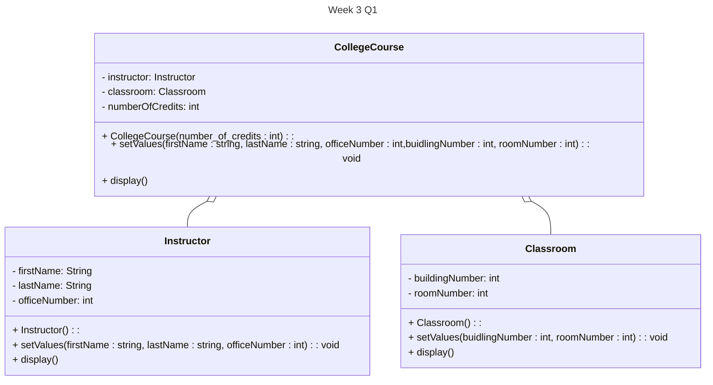
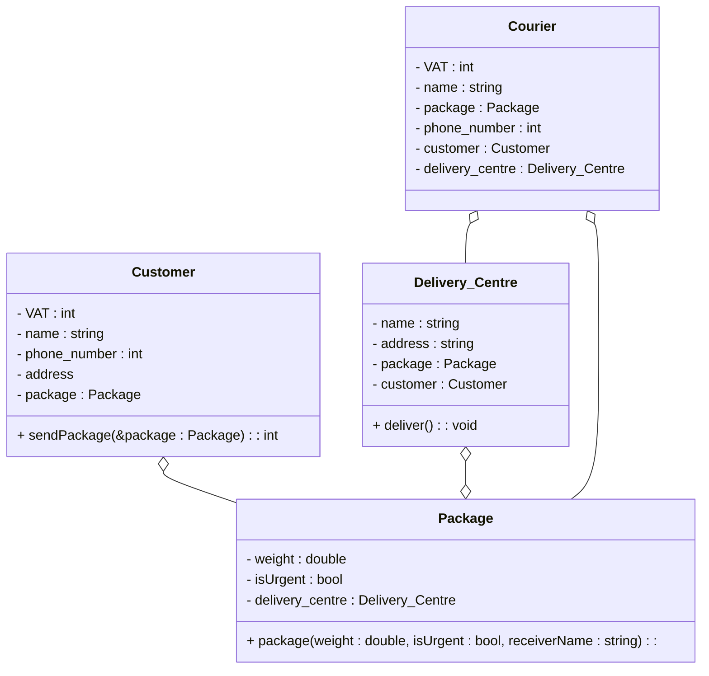
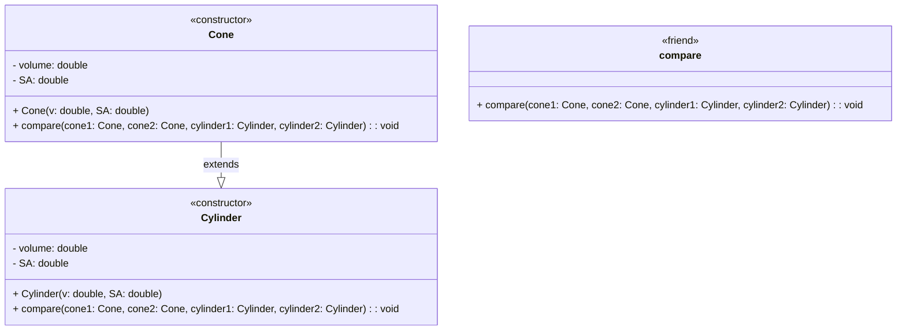

```mermaid
---
title : Week 3 Q1
---
classDiagram

class Instructor{
    - firstName: String
    - lastName: String
    - officeNumber: int
    + Instructor ():
    + setValues(firstName : string, lastName : string, officeNumber : int): void
    + display()
}

class Classroom{
    - buildingNumber: int
    - roomNumber: int
    + Classroom ():
    + setValues(buidlingNumber : int, roomNumber : int): void
    + display()
}

class CollegeCourse{
    - instructor: Instructor
    - classroom: Classroom
    - numberOfCredits: int
    + CollegeCourse (number_of_credits : int):
    + setValues(firstName : string, lastName : string, officeNumber : int,buidlingNumber : int, roomNumber : int): void
    + display()
}

CollegeCourse o-- Instructor
CollegeCourse o-- Classroom
```

```mermaid
---
Title: W3 Q3
---
classDiagram

class Customer{
    - VAT : int
    - name : string
    - phone_number : int
    - address
    - package : Package
    + sendPackage(&package : Package) : int
}

class Delivery_Centre{
    - name : string
    - address : string
    - package : Package
    - customer : Customer
    + deliver(): void
}


class Courier{
    - VAT : int
    - name : string
    - package : Package
    - phone_number : int
    - customer : Customer
    - delivery_centre : Delivery_Centre
}

class Package{
    - weight : double
    - isUrgent : bool
    - delivery_centre : Delivery_Centre
    + package(weight : double, isUrgent : bool, receiverName : string):
}

Customer o-- Package
Delivery_Centre o--o Package
Courier o-- Package
Courier o-- Delivery_Centre


```

```mermaid
classDiagram
    class Cone{
        - volume: double
        - SA: double
        + Cone(v: double, SA: double)
        <<constructor>>
        + compare(cone1: Cone, cone2: Cone, cylinder1: Cylinder, cylinder2: Cylinder): void
        <<friend>>
    }

    class Cylinder{
        - volume: double
        - SA: double
        + Cylinder(v: double, SA: double)
        <<constructor>>
        + compare(cone1: Cone, cone2: Cone, cylinder1: Cylinder, cylinder2: Cylinder): void
        <<friend>>
    }

    Cone --|> Cylinder : extends

    class compare{
        + compare(cone1: Cone, cone2: Cone, cylinder1: Cylinder, cylinder2: Cylinder): void
        <<friend>>
    }


```